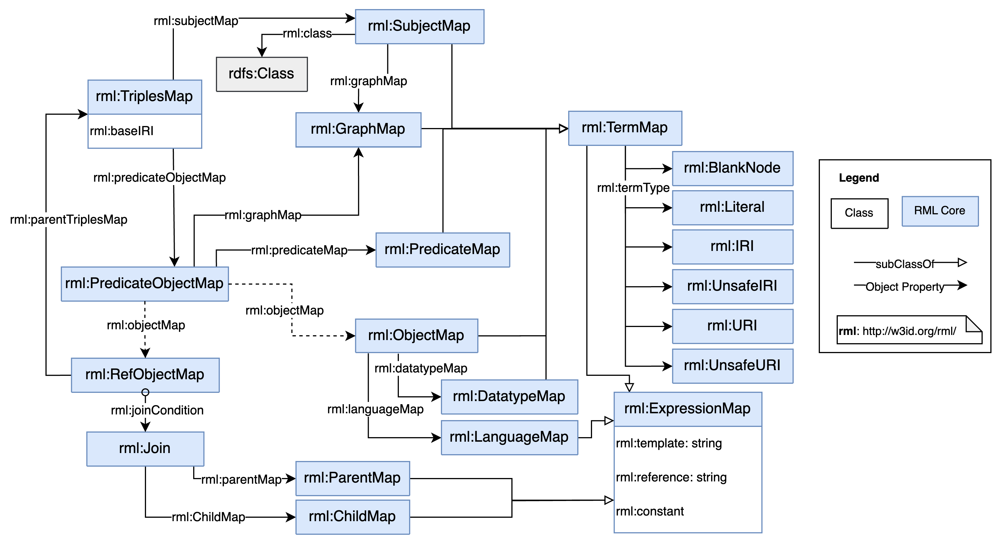

# RML Overview and Example

This section gives a brief overview of the RML mapping language, followed by a simple example of JSON documents with an RML mapping document and its output RDF. Further RML examples can be found in the [RML-core test-cases](http://w3id.org/rml/core/test-cases).

An [=RML mapping=] refers to [=logical sources=] to retrieve data from the [=input data source=].

Each [=logical source=] is mapped to RDF using a [=triples map=].
The [=triples map=] is a rule that maps each iteration in the [=logical source=]
to a number of [=RDF triples=].
The rule has two main parts:

 1. A [=subject map=] that generates the subject of all [=RDF triples=]
 that will be generated from a logical source iteration.
 The subjects often are [=IRIs=].
 2. Multiple [=predicate-object maps=] that
 in turn consist of [=predicate maps=] and [=object maps=]
 (or [=referencing object maps=]).

[=Triples=] are produced by combining the [=subject map=] with a [=predicate map=] and [=object map=], and applying these three to each [=logical iteration=]. For example, the complete rule for generating a set of [=triples=] might be:

Subjects: A template `http://data.example.com/image/{ID}` is used to generate subject [=IRIs=] from the `ID` name.
Predicates: The constant vocabulary [=IRI=] `ex:title` is used.
Objects: The value of the `Title` name is used to produce an [=RDF literal=].
 
By default, all [=RDF triples=] are in the [=default graph=] of the [=output dataset=].
A [=triples map=] can contain [=graph maps=] that
place some or all of the triples into [=named graphs=] instead. 

An overview of the [=RML vocabulary=] is shown in [[[#fig-rml-core-vocabulary]]]:



## Example input data sources

<aside class="example" id="example-input-data-sources" title="Example input data sources">

Input source: images.json
<aside class="ex-input">

```json
{
  "Images": [
    {
      "Width":  800,
      "Height": 600,
      "Title": {
          "lang": "en",
          "value": "View from 15th Floor"
      },
      "Keywords": ["building", "city", "view"],
      "Thumbnail": {
          "Url":    "http://www.example.com/image/481989943",
          "Height": 125,
          "Width":  100
      },
      "Animated" : false,
      "ID": 116
    }
  ]
}
```
</aside>

Input source: album.json
<aside class="ex-input">

```json
{
  "Album": {
    "Title": "City Views",
    "Description": "A collection of stunning cityscape images.",
    "CreatedDate": "2023-10-01",
    "DateFormat": "date",
    "Author": "John Doe",
    "Images": [
      {
        "ID": 116,
        "Reference": "http://www.example.com/image/481989943"
      },
      {
        "ID": 117,
        "Reference": "http://www.example.com/image/481989944"
      }
    ]
  }
}
```

</aside>

</aside>

<aside class="example" id="example-input-data-sources" title="A simple mapping">

The following partial [=RML mapping document=] maps the `images.json` input source to [=RDF triples=].

<aside class="ex-mapping">

```turtle
@prefix rml: <http://w3id.org/rml/> .
@prefix ex: <http://example.com/ns#> .

<#TriplesMap1>
  rml:logicalSource [
    rml:source [
      a rml:RelativePathSource ;
      rml:root rml:MappingDirectory ;
      rml:path "images.json" ;
    ] ;
  ] ;
  rml:subjectMap [
    rml:template "http://data.example.com/image/{ID}" ;
    rml:class ex:Image ;
  ] ;
  rml:predicateObjectMap [
    rml:predicate ex:height ;
    rml:objectMap [
      rml:reference "Height" ;
    ] ;
  ] ;
.

```

</aside>

The following RDF triples are generated by the [=RML mapping=] above

<aside class="ex-output">

```turtle
<http://data.example.com/image/116> a ex:Image .
<http://data.example.com/image/116> ex:height 600 .
```

</aside>

</aside>
