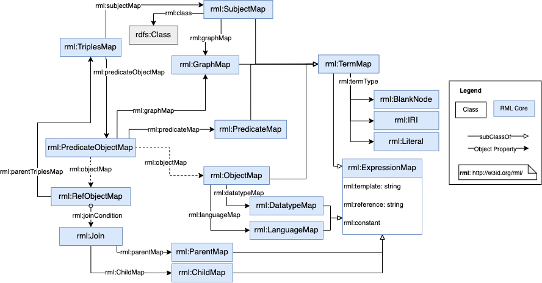

# RML Mapping Documents

### RML Mapping

An <dfn>RML mapping</dfn> defines a mapping from a data source to RDF.
It is a structure that consists of one or more [=triples maps=].

The input to an RML mapping is called the </dfn>input data source</dfn>.

## Mapping Graphs and the RML Vocabulary

An [=RML mapping=] is represented as an [RDF graph]().
In other words, RDF is used not just as the target data model of the mapping,
but also as a formalism for representing the [=RML mapping=] itself.

An [RDF graph]() that represents an [=RML mapping=] is called an <dfn data-lt="mapping graph">RML mapping graph</dfn>.

The <dfn>RML vocabulary</dfn> is the set of IRIs defined in this specification
that start with the `rml:` as prefix and uses namespace IRI: <http://w3id.org/rml/>.

An [=RML mapping graph=]:

1. SHOULD NOT include any [IRIs]() that start with the `rml:` namespace [IRI](),
but are not defined in the RML vocabulary.
2. SHOULD NOT include [IRIs]() from the [=RML vocabulary=]
where such use is not explicitly allowed or required by a clause in this specification.
3. SHOULD contain only [mapping components]()
that are referenced by some triples map
(in other words, all mapping components should actually be “used” in the mapping).
4. MAY contain arbitrary additional [triples]() whose terms are not from the [=RML vocabulary=].
In particular, a valid mapping graph MAY contain documentation
in the form of `rdfs:label`, `rdfs:comment` and similar properties.
5. MAY assign [IRIs]() or [blank node identifiers]() to any [mapping component]()
in order to enable reuse of [mapping components]() within the [mapping graph]().
For example, an [IRI]() that represents a [subject map]()
may be used as the [subject map]() of multiple [=triples maps=];
and may even be used as an object map of another [triples map]()
if it has the right properties.

The [=RML vocabulary=] also includes the following [RML classes]():

* `rml:TriplesMap` is the class of [=triples maps=].
* `rml:LogicalSource` is the class of [logical sources](). 
* `rml:TermMap` is the class of [term maps](). It has four subclasses:
    * `rml:SubjectMap` is the class of [subject maps]().
    * `rml:PredicateMap` is the class of [predicate maps]().
    * `rml:ObjectMap` is the class of [object maps]().
    * `rml:GraphMap` is the class of [graph maps]().
* `rml:PredicateObjectMap` is the class of [predicate-object maps]().
* `rml:RefObjectMap` is the class of [referencing object maps]().
* `rml:Join` is the class of [join conditions]().

The members of these classes are collectively called [mapping components]().

**NOTE**
Many of these classes differ only in capitalization from properties in the [=RML vocabulary=].

Explicit typing of the resources in a mapping graph with [RML classes]() is OPTIONAL
and has no effect on the behaviour of an [RML processor]().
The [mapping component]() represented by any given resource in a mapping graph
is defined by the presence or absence of certain properties,
as defined throughout this specification.
A resource SHOULD NOT be typed as an RML class
if it does not meet the definition of that class.

The [[=default mapping=]]() SHOULD be such that
its output is the [Direct Graph]() [[DM]()] corresponding to the [input data source]().

## RDF-based Turtle Syntax; Media Type

An **_RML mapping document_** is any document written in the [Turtle]() [[TURTLE]]() RDF syntax
that encodes an [=RML mapping graph=].

The media type for [RML mapping documents]() is the same as for Turtle documents in general:
`text/turtle`.
The content encoding of Turtle content is always UTF-8
and the charset parameter on the media type SHOULD always be used:
`text/turtle;charset=utf-8`. The file extension `.ttl` SHOULD be used.

A conforming [RML processor]() SHOULD accept [RML mapping documents]() in Turtle syntax.
It MAY accept [RML mapping graphs]() encoded in other RDF syntaxes.

All RML overview is shown in Figure 1:
<figure>
  
  <figcaption>RML-Core vocabulary.</figcaption>
</figure>
